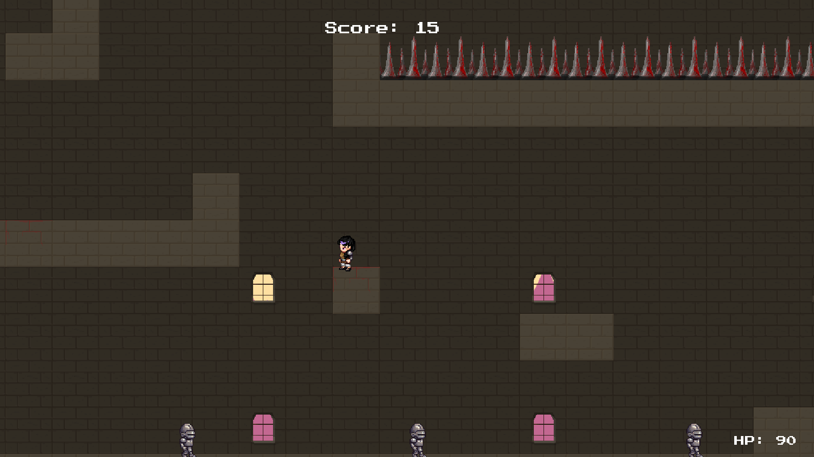

#  Skeletons and Traps! :crossed_swords:

A small SFML game made in about a month.

Type in "make test" to start up the game!
You also go back to menu or close the game by pressing ESCAPE.

You are a lone fighter searching a challenge.. You are trapped in this realm of monster and have to find an exit.
During this travel you have to fight monsters, archers, knights, avoid traps and use your dexterity and strength to jump from platform to platform and wall to wall.

     CONTROLS
-----------------
     A = WALK LEFT
-----------------
     D = WALK RIGHT
-----------------
     W = JUMP
-----------------
    SPACEBAR = ATTACK
-----------------

You can also wall jump by jumping from wall to wall using A and D while holding W!

There are also an item that looks like a green circle with a red cross that you can pick up to gain more health.
There is no limit to how much health you can gain, so be sure to collect as many as you can to make your
journey easier. Good luck!

